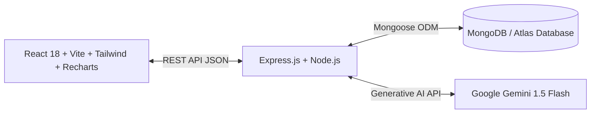

# FitGenius AI — Smart Workout & Fitness Recommendation System 🏋️‍♂️🤖

> **Full-Stack MERN Fitness Intelligence Platform integrated with Google Gemini API & MongoDB**

[](https://github.com/your-username/smart-fitness-recommendation/actions)
[](LICENSE)
[](https://react.dev/)

---

## 📌 Executive Summary

**FitGenius AI** is an intelligent workout and nutrition recommendation platform that uses real-time biometric metrics (BMI calculation according to WHO guidelines, user physical limitations, available equipment, and fitness objectives) combined with **Google Gemini 1.5 Flash AI** to synthesize scientifically periodized workout splits, rep/set volume schemes, and macronutrient targets.

Integrated with a scalable **MongoDB / Mongoose** data architecture and **Recharts** interactive data visualizations, users can track volume load, body recomposition curves, and caloric expenditure across devices, accompanied by real-time conversational assistance from **Coach Alex AI**.

---

## 🚀 Key Features

- **Biometric & BMI Engine**: Live recalculation of Body Mass Index (BMI), health risk classification, and metabolic caloric expenditure estimates.
- **Google Gemini API Integration**:
  - Structured JSON schema generation producing custom multi-day workout splits, warmup/cooldown drills, and biomechanical form cues.
  - Zero-hallucination equipment matching (Dumbbells only, Bodyweight, Resistance Bands, Full Commercial Gym).
  - Built-in graceful local fallback engine ensuring 100% operational uptime even without an active API key or offline testing.
- **Conversational AI Fitness Coach (Alex)**:
  - On-the-fly exercise swaps for injuries or joint discomfort.
  - Science-backed sports nutrition advice (macronutrient splits, pre/post workout feeding windows).
- **MongoDB Data Layer**:
  - Schemas for User Profiles, Generated Workout Plans, and Time-Series Progress Logs.
  - Resilient hybrid storage: auto-detects active MongoDB connection or operates in zero-config memory mode.
- **Visual Analytics Dashboard (Recharts)**:
  - Weight & BMI trend curves.
  - Calorie burn vs. duration per session bar charts.
  - Rating of Perceived Exertion (RPE) intensity distribution pie charts.
- **CI/CD Automation**:
  - GitHub Actions matrix workflow verifying build integrity, package dependencies, and linting on every push.

---

## 🛠️ Architecture & Tech Stack



| Layer | Technologies |
|---|---|
| **Frontend** | React 18, Vite, Tailwind CSS, Lucide React, Recharts |
| **Backend** | Node.js (v20+), Express.js, CORS, Dotenv |
| **AI / LLM** | Google Gemini API (`@google/generative-ai` / Gemini 1.5 Flash) |
| **Database** | MongoDB, Mongoose ODM |
| **DevOps & CI/CD**| GitHub Actions, NPM Workspaces |

---

## 📦 Getting Started

### 1. Prerequisites
- **Node.js**: v18.0.0 or higher
- **MongoDB**: Local MongoDB instance or free [MongoDB Atlas](https://www.mongodb.com/atlas) cluster URI (optional, falls back gracefully).
- **Gemini API Key**: Free key from [Google AI Studio](https://aistudio.google.com/) (optional, intelligent fallback included).

### 2. Installation

Clone the repository and install dependencies for both client and server:
```bash
# Clone the repository
git clone https://github.com/your-username/smart-fitness-recommendation.git
cd smart-fitness-recommendation

# Install server dependencies
cd server
npm install

# Install client dependencies
cd ../client
npm install
```

### 3. Environment Setup

Create a `.env` file in the `server` directory (or copy from `.env.example`):
```env
PORT=5000
MONGODB_URI=mongodb://127.0.0.1:27017/smart_fitness
GEMINI_API_KEY=your_google_gemini_api_key_here
```

### 4. Running the Application

**Option A: Run Server and Client in separate terminals**

Terminal 1 (Backend):
```bash
cd server
npm run dev
# Server running at http://localhost:5000
```

Terminal 2 (Frontend):
```bash
cd client
npm run dev
# Frontend running at http://localhost:3000
```

Visit **`http://localhost:3000`** in your browser!

---

## 📡 REST API Documentation

| Method | Endpoint | Description |
|---|---|---|
| `GET` | `/api/health` | Healthcheck & connection status of DB and Gemini |
| `POST` | `/api/recommendations/generate` | Generates custom workout plan via Gemini API |
| `POST` | `/api/coach/chat` | Conversational query with Gemini AI Coach |
| `GET` | `/api/workouts` | Retrieve saved workout regimens |
| `POST` | `/api/workouts` | Bookmark/save a workout plan |
| `GET` | `/api/progress` | Fetch user time-series workout analytics |
| `POST` | `/api/progress` | Log completed session (weight, calories, duration) |

---

## 📄 License

This project is licensed under the MIT License - see the LICENSE file for details.

